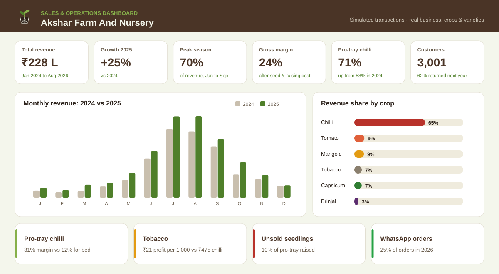

<p align="center">
  
</p>

# Akshar Farm And Nursery: Website and Sales Analysis

<p>
  
  
  
  
  
  
</p>

I built this project for Akshar Farm And Nursery, a working seedling nursery in Jesapura Mithapura
(Thasra taluka, Kheda district, Gujarat). It has two parts: a website for the business, and a data
analysis of its sales and production that ends in a practical sowing plan for the coming months.

**Live:** [Website](https://aksharfarmandnursery.netlify.app/) ·
[Dashboard](https://hetachavda.github.io/akshar-nursery-analytics/dashboard/) ·
[Notebook](notebooks/akshar_nursery_analysis.ipynb)

## 📌 Project at a Glance

| Area | Details |
|---|---|
| **Goal** | Help the nursery decide what to sow and when, reduce unsold seedlings and see which crops actually make money |
| **Approach** | Structure the business into four tables, analyse them in Python and SQL, and turn the results into a sowing plan |
| **Focus** | Seasonality, crop and variety performance, pro-tray vs nursery bed, customers, germination, waste and margin |
| **Output** | Business website (English, Gujarati, Hindi), analysis notebook, 11 SQL queries and a dashboard |

## 🧩 Background

The nursery grows F1 hybrid chilli, capsicum, tomato, brinjal, marigold and tobacco seedlings in a
polyhouse, shade-net tunnels and open beds, and sells them to farmers, dealers and a few home gardeners.

A seedling takes 25 to 48 days to be ready, so every sowing is a bet on demand more than a month ahead.
If the nursery sows too little, farmers buy elsewhere during the peak season. If it sows too much, costly
hybrid seed turns into seedlings nobody buys.

Like most small nurseries in the area, it runs on experience and a paper register. There was no easy way to
answer questions like: how seasonal is demand really, is pro-tray worth the extra cost, and how much stock
goes to waste? The business also had no website, only a Google Maps listing.

## 🗂️ Data

| Data | Details |
|---|---|
| Business, crops, varieties | **Real.** 6 crops and 16 varieties from 9 seed brands, taken from seed packets photographed at the nursery |
| Sales transactions | **Simulated.** 6,824 orders from January 2024 to August 2026 |
| Customers | 3,001 buyers across 12 villages, between 1 and 42 km away |
| Production | 846 sowing batches with seeds sown, germination, unsold seedlings and cost |

A note on the data: the nursery keeps paper records, so I could not use its real sales for this version. I
wrote a generator ([`src/generate_data.py`](src/generate_data.py)) that creates realistic transactions around the
real crops, varieties and villages, and I listed every price, cost and seasonal assumption in
[`docs/assumptions.md`](docs/assumptions.md). The numbers below show what the analysis finds on that data. They are
not the owner's actual figures. I also made a simple sales log template
([`data/templates/daily_sales_log_template.csv`](data/templates/daily_sales_log_template.csv)) so real sales can
be recorded and run through the same code.

## 🔬 How I Approached It

1. **Captured the real business.** Collected photos of the seed packets and facilities, and noted the crops,
   methods, hours and nearby villages.
2. **Designed the data model.** Four tables (`orders`, `customers`, `varieties`, `production_batches`), loaded into SQLite.
3. **Checked data quality.** Duplicate IDs, missing keys, revenue matching quantity × price × discount, and no batch
   selling more seedlings than it produced.
4. **Analysed it** in Python and SQL: monthly trends and year-on-year growth, variety ranking, pro-tray vs bed
   economics, customer retention by first-purchase year, germination, unsold stock and gross margin.
5. **Built a sowing plan** for September to December 2026: last year's volume for the month × this year's growth for
   the crop, plus a 10% buffer, divided by germination rate to get seeds to sow.
6. **Shared it** as a dashboard for the owner and a website for the nursery's customers.

## 📊 Dashboard

<p align="center">
  
</p>

The full dashboard, with all 11 charts and the sowing plan table, is in [`dashboard/`](dashboard/).

## 📈 What the Analysis Shows

- **The business is growing.** Revenue grew 25% in 2025, and January to August 2026 is up 33% on the same months last year.
- **Demand is very seasonal.** June to September brings 70% of the year's revenue, so chilli sowing has to start in late April.
- **Chilli carries the nursery.** It is 65% of revenue, and VNR 332 (Rani) is the best-selling variety.
- **Pro-tray is worth it.** Farmers are switching (chilli pro-tray share went from 58% to 71%), and pro-tray chilli earns a
  31% gross margin against 12% for bed chilli. Lower germination in beds wastes a lot of expensive hybrid seed.
- **Dealers are important but risky.** They bring 48% of revenue, and 38% of that is sold on credit.
- **Farmers come back.** 62% of customers who first bought in 2024 bought again in 2025.
- **Tobacco sells the most seedlings but earns the least.** About ₹21 gross profit per 1,000 seedlings, compared with ₹475 for pro-tray chilli.
- **About 10% of pro-tray seedlings go unsold,** mostly because of over-sowing as a safety margin.
- **Customers are moving online.** WhatsApp orders reached 25% in 2026, and UPI went from 33% to 50% of revenue.

## 💼 Recommendations for the Owner

| Area | Recommendation |
|---|---|
| Planning | Book seed and cocopeat for chilli, capsicum and tomato by April, following the sowing plan |
| Waste | Take advance bookings on WhatsApp with a small deposit, and aim to bring unsold pro-tray stock down to about 5% |
| Product mix | Recommend pro-tray for chilli and capsicum: better price, germination and margin |
| Credit | Set a credit limit and a 30-day due date for dealers, and check outstanding amounts every week |
| Tobacco | Keep it for customer loyalty, but review the price per 1,000 or bundle it with chilli orders |
| Marketing | Use the website and WhatsApp for pre-season booking, and ask happy farmers for Google reviews |

## 🌐 The Website

The nursery had no website, so I built one: [`website/index.html`](website/index.html). It works in English, Gujarati
and Hindi and is designed mainly for farmers on mobile phones. It includes:

- crops and the 13 seed varieties grown, each shown with its real seed packet
- the sowing process from seed to dispatch, with photos from the nursery
- one-tap call and WhatsApp buttons for both contact numbers
- a review helper that makes it easier for customers to leave a Google review
- a digital business card with a QR code, and business details that Google can read for local search

## 🛠️ Tools

| Area | Tools |
|---|---|
| Analysis | Python, pandas, NumPy |
| SQL | SQLite: CTEs, window functions (`LAG`, `RANK`, running totals), joins |
| Charts | Matplotlib, HTML/SVG dashboard |
| Methods | Seasonality, Pareto analysis, retention cohorts, unit economics, simple seasonal forecast |
| Web | HTML, CSS, JavaScript |

## 🚀 Running It

```bash
git clone https://github.com/hetachavda/akshar-nursery-analytics.git
cd akshar-nursery-analytics
pip install -r requirements.txt
python src/run_all.py
```

`run_all.py` generates the data, builds the database, runs the notebook, and rebuilds the dashboard and the
images in this README. You can also open the notebook directly in Jupyter, VS Code or Google Colab.

## 📁 Repository Structure

```
akshar-nursery-analytics/
├── assets/            banner and dashboard images for this README
├── website/           business website
├── dashboard/         full dashboard (11 charts + sowing plan)
├── notebooks/         main analysis notebook, saved with outputs
├── sql/               11 business questions in SQL
├── data/
│   ├── raw/           orders, customers, varieties, production_batches
│   ├── nursery.db     SQLite database
│   └── templates/     daily sales log for real data
├── reports/           charts, written findings, KPI numbers
├── src/               scripts that build everything
├── docs/              data dictionary, assumptions, GitHub setup
├── index.html         landing page for GitHub Pages
└── requirements.txt
```

## 🔭 What's Next

- Get the owner to log one season of real sales in the template, then rerun the analysis on real numbers.
- Compare my September to December 2026 forecast with what actually sells.
- Add a simple booking form to the website so advance orders are recorded automatically.

---

**Heta Chavda** · Data Analytics

<a href="https://github.com/hetachavda"></a>
<a href="https://www.linkedin.com/in/hetachavda/"></a>
